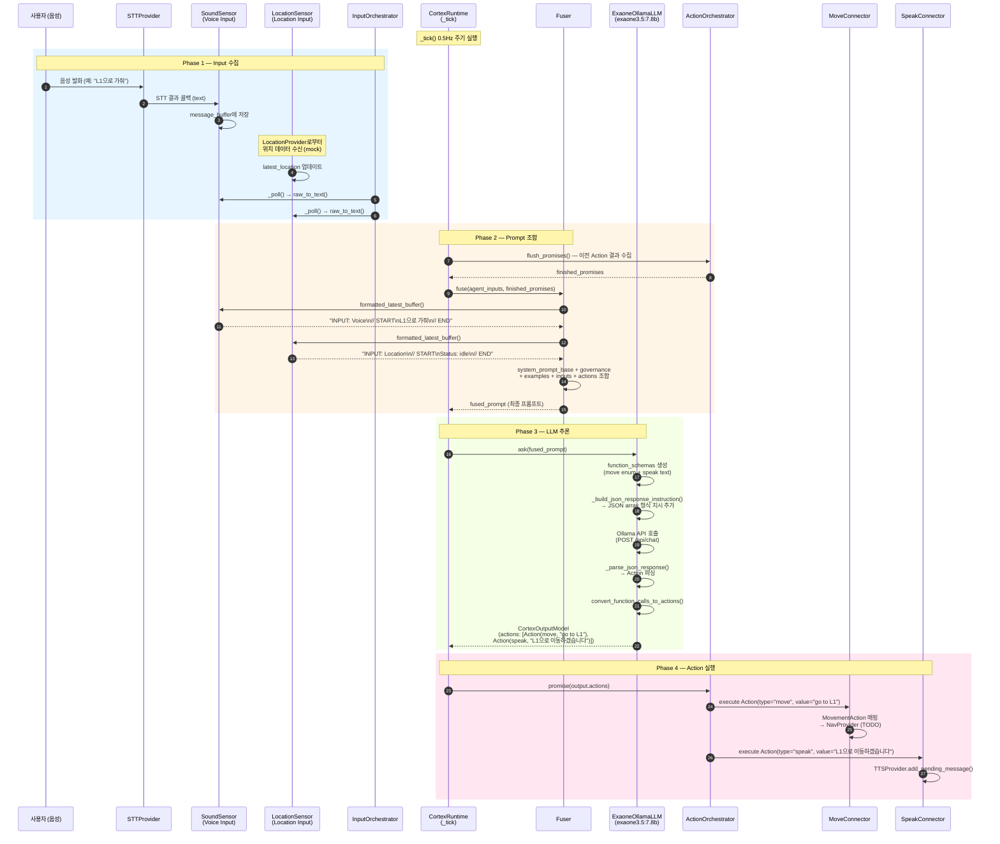
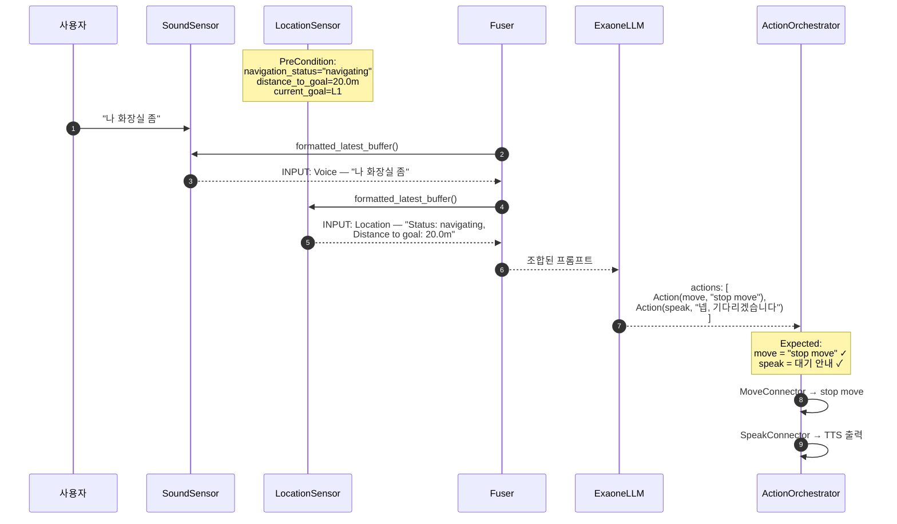
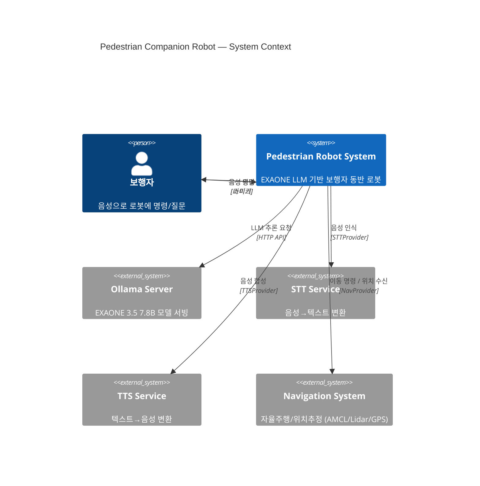
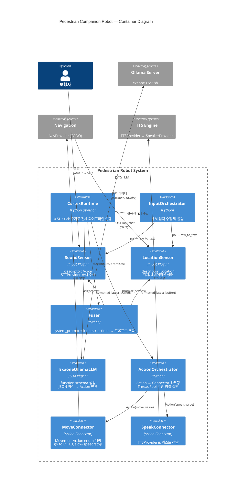
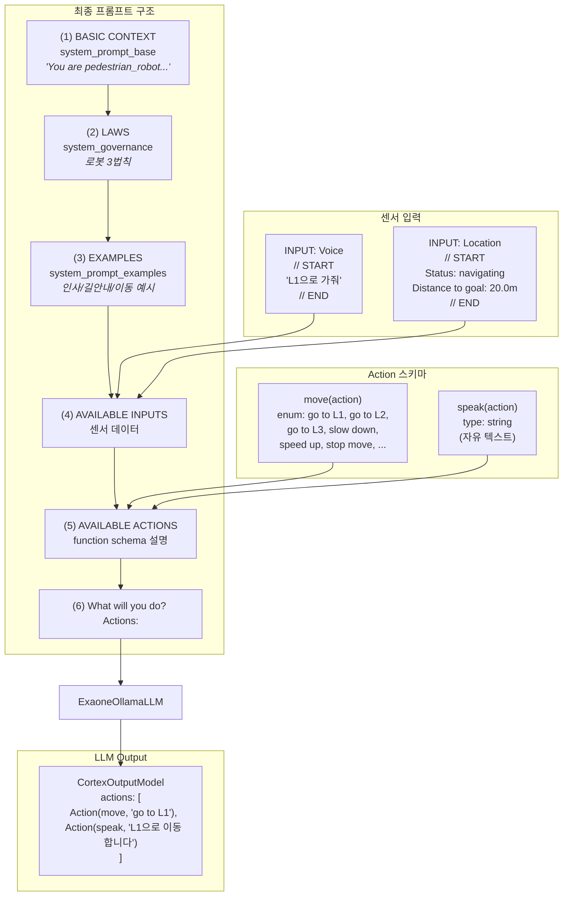
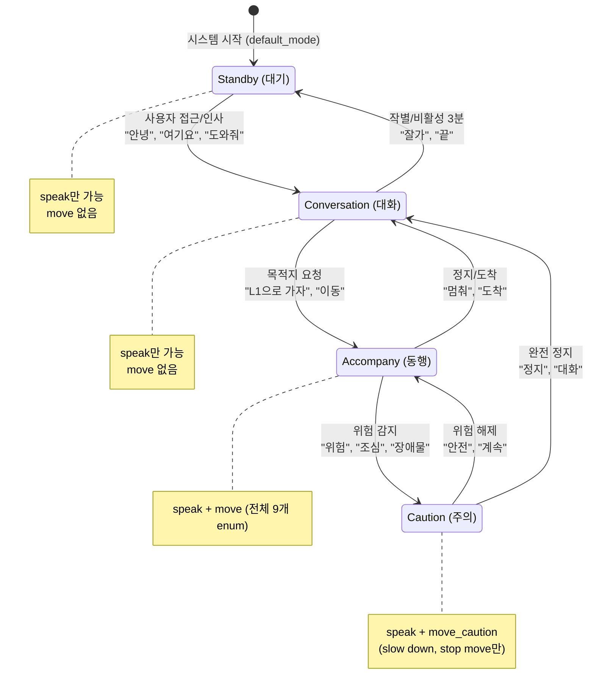
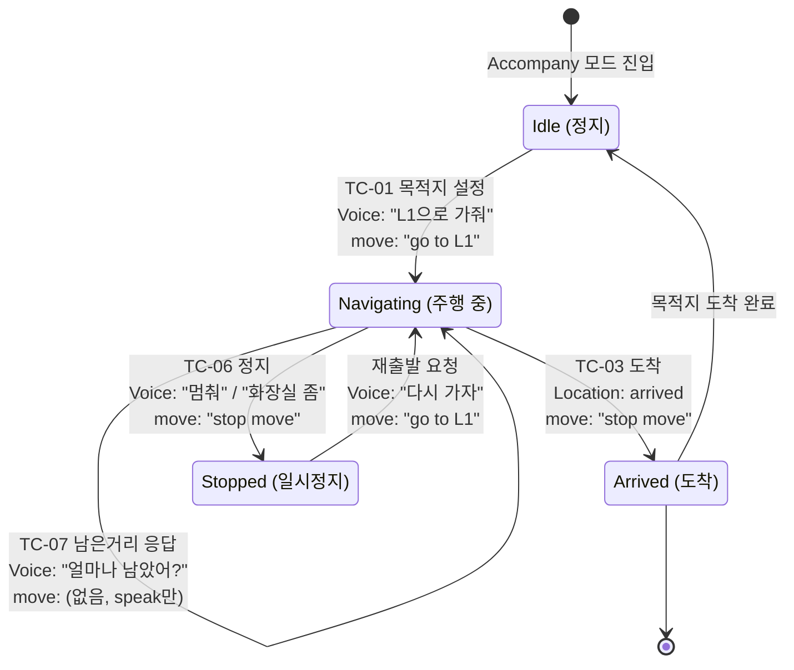

# EXAONE LLM Output 테스트 - 아키텍처 다이어그램

## 1. 시퀀스 다이어그램 (전체 Tick 사이클)

사용자 음성 입력 → LLM 응답 → Action 실행까지의 한 사이클 흐름

## 2. 시퀀스 다이어그램 (테스트 시나리오별 — 주행 중 정지 예시)

TC-06c: 주행 중 "나 화장실 좀" 발화 시 흐름

## 3. C4 Context 다이어그램 (시스템 전체)

## 4. C4 Container 다이어그램 (내부 모듈)

## 5. 데이터 흐름 다이어그램 (Fuser 프롬프트 구조)

## 6. 모드 전환 상태 다이어그램

## 7. 테스트 시나리오 상태 전이 다이어그램 (Accompany 모드 내)

